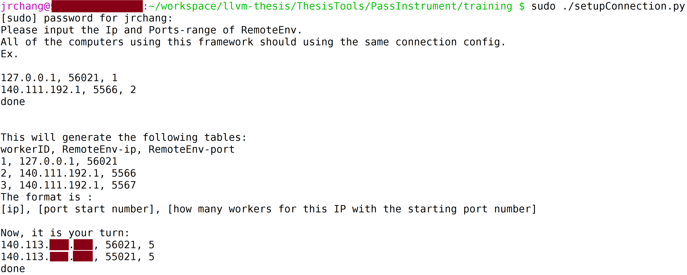

This ThesisTools must cooperate with the corresponding branch of LLVM and Clang
==================================================================================

ThesisTools directory tree
-----------------------------------------------------
* The following directories are the `active` for our projects.
  * PassInstrument
    * `training`
    * `inference`
  * RandomSelect
    * `LLVMTestSuiteScript`
* The following directories are legacy, you can ignore or remove them. They are no longer maintained.
  * RandomSelect
    * ExternalBenchmarkScript
  * benchmark

Prerequisite packages
-----------------------------------------------------
* OS: Ubuntu 16.04 64 bit
* We use gcc 7.2 as our default compiler to compile the LLVM/Clang
  * gcc 7.3 is also tested.

```
sudo apt install cmake
sudo apt install libelf-dev
sudo apt install libncurses5-dev
sudo apt install libgoogle-perftools-dev
sudo apt-get install google-perftools libgoogle-perftools-dev
sudo apt install graphviz
sudo apt install linux-tools-common linux-tools-generic linux-cloud-tools-generic

#install kernel specific perf tools, you can type "$ perf " to see the corresponding version.
sudo apt install linux-tools-4.10.0-38-generic linux-cloud-tools-4.10.0-38-generic
sudo sh -c 'echo kernel.perf_event_paranoid=0 > /etc/sysctl.d/local.conf'
sudo sh -c 'echo kernel.kptr_restrict=0 >> /etc/sysctl.d/local.conf'

# gcc 7.2
sudo add-apt-repository ppa:ubuntu-toolchain-r/test
sudo apt-get update
sudo apt-get install gcc-7 g++-7

# packages for python3(Our framework is based on Python3)
sudo -H pip3 install psutil
sudo -H pip3 install progressbar2
sudo -H pip3 install ruamel_yaml
sudo -H pip3 install virtualenv
sudo -H pip3 install colorama
sudo -H pip3 install sklearn
sudo -H pip3 install pytz
```

Add below environment variables to your .bashrc:
------------------------------------------------------

* OS: Ubuntu 16.04 64 bit
* No matter what branch you are using, the following are the same.
* ThesisTools only has `master` branch
  * `LLVM` and `Clang` have different branches for different purposes.

__The environment variable below will affect what compiler yor are going to use.__
---------------------------------------------------------------------------------------
* Please read them.
  * `$LLVM_THESIS_HOME` and `$PPO_OptClang` must be properly set.
  * The following instructions assume that your base working directory is "~/workspace/"
    * If you change to the place you like, please also modify the environment variables.

```
#if you want lit to get these env, you need to modify "llvm-thesis/utils/lit/lit/TestingConfig.py"
export LLVM_THESIS_HOME=$HOME/workspace/llvm-thesis
export LLVM_THESIS_RandomHome=$LLVM_THESIS_HOME/ThesisTools/RandomSelect
export LLVM_THESIS_InstrumentHome=$LLVM_THESIS_HOME/ThesisTools/PassInstrument
export LLVM_THESIS_TrainingHome=$LLVM_THESIS_InstrumentHome/training
export LLVM_THESIS_TestSuite=$LLVM_THESIS_HOME/test-suite/build
export LLVM_THESIS_Random_LLVMTestSuiteScript=$LLVM_THESIS_RandomHome/LLVMTestSuiteScript
export LLVM_THESIS_Random_LLVMTestSuite_Results=$LLVM_THESIS_Random_LLVMTestSuiteScript/results
export LLVM_THESIS_lit="$LLVM_THESIS_HOME/utils/lit/lit.py"
export PPO_OptClang="$HOME/workspace/PPO-OptClang"
# For reward policy 2
export LLVM_THESIS_REWARD_LIB="$LLVM_THESIS_TrainingHome/RewardPolicy2-Tools/sharedLib"
export LLVM_THESIS_REWARD_HEADER="$LLVM_THESIS_REWARD_LIB/headers"
export C_INCLUDE_PATH=$LLVM_THESIS_REWARD_HEADER/c:$C_INCLUDE_PATH
export CPLUS_INCLUDE_PATH=$LLVM_THESIS_REWARD_HEADER/cpp:$CPLUS_INCLUDE_PATH
export LD_LIBRARY_PATH=/opt/lib:$LD_LIBRARY_PATH
# avoid -L/opt/lib for reward policy 2
export LIBRARY_PATH=/opt/lib:$LIBRARY_PATH
export PYTHONPATH=$PPO_OptClang:$LLVM_THESIS_TrainingHome:$LLVM_THESIS_InstrumentHome/PyActor:$LLVM_THESIS_Random_LLVMTestSuiteScript:$LLVM_THESIS_RandomHome:$PYTHONPATH
alias lit=$LLVM_THESIS_lit  #this lit is modified to read the above env


# Make sure $clang++ and $clang are using your build (For `RandomSelect`)
export PATH=$LLVM_THESIS_HOME/build-release-gcc7/bin:$PATH
```

* How does these environment variable be gotten in PyActor?
    * You may want to take a look at `llvm/utils/lit/lit/TestingConfig.py`

Using the "RandomSelect/LLVMTestSuiteScript" to generate the "Random-Graphs"
===============================================================================
* The related directory is at [here](RandomSelect/LLVMTestSuiteScript/GraphGen).
* Check the [ipynb](RandomSelect/LLVMTestSuiteScript/GraphGen/genGraphAnalysis.ipynb) to veiw the `raw` figures.
  * Use ipython(from Anaconda) to execute it.

How to build LLVM/Clang for "RandomSelect/LLVMTestSuiteScript"
---------------------------------------------------------------------
* "RandomSelect" have two kinds:
  * Benchmark-Level: Random Function-Passes for each benchmarks/applications in `test-suite`
  * Function-Level: Based on the Benchmark-Level, if the function can be profiled, random Function-Passes for this function.
* You should run `Benchmark-Level` first to generate data for `Function-Level` to check whether this function is worth applying random `Function-Level` passes.
  * This is because their are too many possibilities. We just want to see the possibilities that `Function-Level` may outperform the `Benchmark-Level`.
* __Build Instructions for LLVM and Clang__
  * The `Benchmark-Level` and `Function-Level` building guides only different from the branch name, which are:
    * `RandomSelect-BenchmarkLevel`
    * `RandomSelect-FunctionLevel`
  * In the following instructions, we use `RandomSelect-BenchmarkLevel` as example.
```
git clone https://github.com/JaredCJR/llvm llvm-thesis
cd llvm-thesis
git checkout -b RandomSelect-BenchmarkLevel remotes/origin/RandomSelect-BenchmarkLevel
git submodule update --init --recursive --remote
-----------------------------
# Optional, update to the latest version.
# The branch will remember the last version that I used. However, it may be outdated for other branches.
# It is recommended to pull.
cd ThesisTools
git checkout master
git pull
-----------------------------
cd tools
git clone https://github.com/JaredCJR/clang
cd clang
git checkout -b RandomSelect-BenchmarkLevel remotes/origin/RandomSelect-BenchmarkLevel


-----------------------------
# The following project is not used in "RandomSelect", but I recommend you clone it for later usage.
cd clang/tools
git clone https://github.com/llvm-mirror/clang-tools-extra extra
git checkout -b release_50 remotes/origin/release_50
-----------------------------


cd /path/to/llvm
mkdir build-release-gcc7 && cd build-release-gcc7
# Change "Release" to "Debug", if you want to gdb it. However, "Debug" is very slow in building and running.
cmake -G "Unix Makefiles" -DCMAKE_BUILD_TYPE=Release -DCMAKE_C_COMPILER=gcc-7 -DCMAKE_CXX_COMPILER=g++-7 -DLLVM_TARGETS_TO_BUILD="X86" ../
```


How to use "RandomSelect/LLVMTestSuiteScript"
-------------------------------------------------------------------
* "RandomSelect/ExternalBenchmarkScript" is the legacy implementation, we will not explain it here.
* Assumption
  * test-suite is cloned at `llvm/test-suite`
  * Python 3 and related packages
    * For example:
      * `pip3 install progressbar2`
      * `pip3 install psutil`
      * `pip install ruamel_yaml`
```
source ~/.bashrc
cd $LLVM_THESIS_Random_LLVMTestSuiteScript
cd PyActor/WithStdin
make
cd -
cd PyActor/WithoutStdin
make
cd -
cd DropCache/
cat README
(follow the README guide)

cd -
./LitDriver.py [Standard | Random | Selected.SingleCore | Random-FunctionLevel]
[
 "Standard" must with official Clang-5.0 |
 "Random" must with Benchmark-Level Thesis-Clang-5.0 |
 "Selected.SingleCore" must with official Clang-5.0 to show that proper multi-thread does not affect the experiments.
 "Random-FunctionLevel" must with Function-Level Thesis-Clang-5.0
]

```
* `Benchmark-Level Thesis-Clang-5.0` is the branch of `RandomSelect-BenchmarkLevel` in JaredCJR/llvm and JaredCJR/clang
* `Function-Level Thesis-Clang-5.0` is the branch of `RandomSelect-FunctionLevel` in JaredCJR/llvm and JaredCJR/clang
    * `$ ./PredictionDaemon.py start` and `$ ./PredictionDaemon.py stop` may be necessary.

* Both of two `Thesis-Clang-5.0` must use the branch `thesis_50` of JaredCJR/test-suite
* `ThesisTools` always need to be the latest version for all branches

Build llvm "test-suite" manually
------------------------------------------------
* This is implemented in `LitDriver.py`
* This procedure may be helpful for debugging.
```
cd llvm/test-suite
mkdir build
cd build

----------------------------
# make sure $CC and $CXX are set to the compiler that you want to test with test-suite.
CC=clang CXX=clang++ cmake ../
# Or use the absolute path. For example:
cmake -DCMAKE_C_COMPILER=/home/jrchang/workspace/llvm-thesis/build-release-gcc7/bin/clang -DCMAKE_CXX_COMPILER=/home/jrchang/workspace/llvm-thesis/build-release-gcc7/bin/clang++ ../
----------------------------

make -j12
```

If lit failed, how to see the program output message?
------------------------------------------------------------
* The original lit will remove the ".test.output" file.
  * The lit in our version already modified to leave it there for debugging.
```
cd llvm-source/test-suite/build/path-to-your-target-build/
lit XXX.test # run again to produce the error message
cat Output/XXX.test.out # This is what you want.
```

Use "RandomSelect/LLVMTestSuiteScript/GraphGen/genGraphAnalysis.ipynb" to generate the graphs
------------------------------------------------------------------------------------------------
* Install the latest stable Anaconda3 for Ubuntu 16.04
* Run the genGraphAnalysis.ipynb as any other python3 projects.
  * You should prepare the data as the above instructions by using the "LitDriver.py"


Training framework in "PassInstrument"
=========================================
*  __The passes in "PassPrediction-*" are already rewritten.__
  * This tools may only be used when you modify the `Rewriter`.
  * The rewritten passes are already committed with the llvm or clang branches for our project.

[How to build] Rewriter to insert instrumentation code:
---------------------------------------------------------
* Build LLVM/Clang for Rewriter
  * The clone procedure is really similar to the official guide.
  * The prerequisite packages are as same as the above guide.
     * Also, we use gcc 7.2(or above) as out compiler to build LLVM/Clang
```
git clone https://github.com/llvm-mirror/llvm llvm-official
cd llvm-official
# The version we use is 5.0.1
git checkout -b release_50 remotes/origin/release_50

cd tools
git clone https://github.com/llvm-mirror/clang
cd clang
# The version we use is 5.0.1
git checkout -b release_50 remotes/origin/release_50

cd tools
git clone https://github.com/llvm-mirror/clang-tools-extra extra
git checkout -b release_50 remotes/origin/release_50

cd ../../../
mkdir build-release-dump-gcc7
cd build-release-dump-gcc7
# time to cmake

cmake -DCMAKE_BUILD_TYPE=Release \
         -DCMAKE_C_COMPILER=gcc-7 \
         -DCMAKE_CXX_COMPILER=g++-7 \
         -DLLVM_ENABLE_ASSERTIONS=ON \
         -DCMAKE_C_FLAGS=-DLLVM_ENABLE_DUMP \
         -DCMAKE_CXX_FLAGS=-DLLVM_ENABLE_DUMP \
         -DLLVM_TARGETS_TO_BUILD="X86" \
         -G "Unix Makefiles" \
         ../

make -j12
```

* Build Rewriter
  * Assuming the previous `build-release-dump-gcc7` is at `~/workspace/llvm-official/`
  * If you really use this path, you don't have to modify the variables inside `ThesisTools/PassInstrument/Makefile`
  * Otherwise, modify the variables: `LLVM_SRC_PATH` and `LLVM_BUILD_PATH`
  * The following instructions assumes that you have the variables properly set.
```
make
```

[How to use] Rewriter to insert instrumentation code:
---------------------------------------------------------
* We use `libtooling` to release the burden to find the headers, but you need to pass them as arguments.
* `Clang-tidy` is part of our `Passes Rewriter`, you must build your own `Clang-tidy` as the above guide.
* __The `Rewritter` assume the passes inside `llvm-thesis` are not instrumented.__
* The proper environment variables must be set properly.
  * Refer to `llvm-thesis/ThesisTools/PassInstrument/script/Var.sh`
* `llvm-thesis/ThesisTools/PassInstrument/script/SystemHeaders` may different from operating systems and your packages.
  * `llvm-thesis/ThesisTools/PassInstrument/script/README.md` has some tricks for you to check.
```
cd /path/to/llvm-thesis/ThesisTools/PassInstrument/
./ScriptDriver.sh
# You will see options, read them!
# In my cases, Clang-tidy 5.0.1 has bugs, and I already reported to the community.
# I am not sure when will it be fixed, and we may need to fix it manually.
# Normally, choose the options with the order: "1" --> "2" --> "3"
# However, after option "1", it is our turn to fix the bug!
# "Database/TidiedPasses/NewGVN.cpp line 2099 and 2100"
# The "semicolon" is misplaced.

# If you want to debug your "Rewritter", option "1" doesn't need to be executed multiple times.
```

How to build LLVM/Clang for training framework
---------------------------------------------------------

 * Our framework based on LLVM/Clang 5.0.1
```
git clone https://github.com/JaredCJR/llvm llvm-thesis
cd llvm-thesis
git checkout -b PassPrediction-training remotes/origin/PassPrediction-training

git submodule update --init --recursive --remote
cd ThesisTools
git checkout master
git pull
cd ../

cd tools
git clone https://github.com/JaredCJR/clang
cd clang
git checkout -b PassPrediction-training remotes/origin/PassPrediction-training

# We use multiple clang with cmake-defined var, the following procedure only show for "one" worker.
# In my cases, Intel i7-8700K has 6 cores with 12 threads, I apply core 0 as the TCP server and core 1~5 as the "workers".
# Therefore, I need to build 5 clang with different "WorkerID"
# The following example is for "worker1"
# Notice the  variable in cmake command "DAEMON_WORKER_ID"

mkdir build-release-gcc7-worker1
#Note: if you change the dir name, you have to modify the related parts in the PredictionDaemon.py
cd build-release-gcc7-worker1

cmake -DCMAKE_BUILD_TYPE=Release \
         -DCMAKE_C_COMPILER=gcc-7 \
         -DCMAKE_CXX_COMPILER=g++-7 \
         -DLLVM_ENABLE_ASSERTIONS=ON \
         -DCMAKE_C_FLAGS=-DLLVM_ENABLE_DUMP \
         -DCMAKE_CXX_FLAGS=-DLLVM_ENABLE_DUMP \
         -DLLVM_TARGETS_TO_BUILD="X86" \
         -DDAEMON_WORKER_ID="1" \
         -G "Unix Makefiles" \
         ../

make -j12
# Repeat the above for all your workers with different WorkerID
```

How to prepare "PyActor" for training framework:
---------------------------------------------------------
```
cd llvm-thesis/ThesisTools/PassInstrument/PyActor
cd WithStdin
make
cd ../WithoutStdin
make
```

How to setup network connection for training framework:
---------------------------------------------------------
* All the systems in the framework need to setup the network connection as follows.
  * However, only the "Env server" will be able to daemonize itself.
    * This will not affect the functionalites.
    * If there is a future version, we will fix it.
```
cd llvm-thesis/ThesisTools/PassInstrument/training
# Every boot should execute "once" to setup the Iptables properly.
# if you can set Iptables without sudo, you can execute this withou sudo
# Execute it multiple times may cause the rules self-conflict to drop the packets.
sudo ./setupConnection.py
# There are examples show on the shell, read it !
# The format is :
# [ip], [port start number], [how many workers for this IP with the starting port number]

## A more convenient approach:
## $ sudo ./setupConnection.py < ips.txt
## write the content inside ips.txt
```

* Usage example:


How to test network connection with fakeEnv.py
---------------------------------------------------------
* Assuming there are two computers
  * System A
    * Serve the fakeEnv.py to hire "workers"
  * System B
    * Serve the clang workers
    * In my cases,
      * i7-8700k: core 0 as the server, core 1~5 as the workers
* All computers/systems must setup with the `setupConnection.py` with the same configuration.

* On System B(This must be set first)
```
cd llvm-thesis/ThesisTools/PassInstrument/training
taskset -c 0 ./DaemonStart.sh all
# If you encounter failure, restart the daemon with same command "multiple times".
# Sometimes, it just the previous workers need time to finish its previous work.
```

* On System A
```
cd llvm-thesis/ThesisTools/PassInstrument/training
./fakeEnv.py
# Then, you should see results from different remote workers.
```

Install "gym-OptClang"
---------------------------------------------------------
* Refer to [gym-OptClang](https://github.com/JaredCJR/gym-OptClang)
  * `git clone https://github.com/JaredCJR/PPO-OptClang`

Install "PPO-OptClang"
---------------------------------------------------------
* Refer to [PPO-OptClang](https://github.com/JaredCJR/PPO-OptClang)
```
cd workspace
git clone https://github.com/JaredCJR/PPO-OptClang
```

How to train the model
---------------------------------------------------------
* How to create daemons:
  * The following instructions assume that you have three computers(thress systems)
    * System A(train the model)
    * System B1(build, run and verify the programs)
    * System B2(build, run and verify the programs)
  * Guide Overview:
    * First: setup network connection as the previous tutorial on __all systems__.
    * Second: Bring up the daemons on the __worker systems__.
```
# On System B1 and B2:
cd PassInstrument/training/
taskset -c 0 ./PredictionDaemon.py stop [WorkerID] ## This is recommend, but not necessary.
taskset -c 0 ./PredictionDaemon.py start [WorkerID] ## Necessary.
## e.g.  if System B2 has worker 6~10:
## taskset -c 0 ./PredictionDaemon.py start 6
## taskset -c 0 ./PredictionDaemon.py start 7
## taskset -c 0 ./PredictionDaemon.py start 8
## taskset -c 0 ./PredictionDaemon.py start 9
## taskset -c 0 ./PredictionDaemon.py start 10

# On System A:
## Do nothing, but run "PPO-OptClang" on System A as the below guide.
```
* run
  * Please refer to [JaredCJR/PPO-OptClang](https://github.com/JaredCJR/PPO-OptClang)

How to check the messages from "PredictionDaemon.py"
---------------------------------------------------------
* All the stdout/stderr are redirect to /tmp/PredictionDaemon*

How to use the trained model to inference
---------------------------------------------------------
* Build LLVM/Clang for inference as same as the procedure in [Training Framework](#how-to-build-llvmclang-for-training-framework)
  * Make sure your environment variable $LLVM_THESIS_HOME point to the llvm dir of inference-branch
* __Except the branch name: replace `PassPrediction-training` with `PassPrediction-inference`__
* [Setup the network connection as the Training Framework](#how-to-setup-network-connection-for-training-framework)

```
# make sure the following points:
# 1. "PPO-OptClang" is already cloned as the environment variable says($PPO_OptClang).
# 2. "gym-OptClang" is installed with the Daemon(s).
cd ./PassInstrument/inference
./PredictionDaemon start [WorkerID] # You can launch it with different WorkerID for multiple workers
(Then, use the Clang as the normal Clang)
(/tmp/PassPrediction-* have logs for each worker to debug)
```

* How to use the model that you want.
  * `vim PassInstrument/inference/tfServer.py`
    * find `RelativeLogDir` and `ModelName`
      * `RelativeLogDir` is the inference directory to save the trained model, which is a relative path to `PPO-OptClang`
      * `ModelName` is the saved checkpoint prefix for tensorflow.
      * In restoring the model, we use the latest checkpoint. If you want specific checkpoint, you have to do this by yourself.


How to evaluate the trained model
==============================================

Inference Runtime Evaluation
----------------------------------
The first point is not important, you can jump to second point.

* We run the `test-suite/MultiSources/Applications` manually(Most of the statistics of runtime do not have a fully automatic script).
  * All the raw-data is at [here](PassInstrument/inference/RuntimeEvaluation/raw-data).
    * The script for producing statistics is at [here](PassInstrument/inference/RuntimeEvaluation/BuildTimeAnalysis.ipynb).
    * These data is not all of them.
* The preprocessed data(Microsoft Excel format) are [here](PassInstrument/inference/RuntimeEvaluation/buildEval_graph_withStat.xlsx).
  * The figures of runtime are also inside it.


Trained Model Evaluation(Speedup) For Inference
-------------------------------------------------
* The directory is at [here](PassInstrument/inference/SpeedupEvaluation).
  * Run `LoadAndDraw.ipynb` with ipython(from Anaconda) can reproduce the figures.
* If you would like to run the speedup evaluation by yourself
  * Simply run `RunSpeedupEval.py` with python3.
    * The log directory will be produced after evaluate all apps(takes about 10 hours on i7-8700k) with date time.
  * When it finished, run `LoadAndDraw.ipynb` with modifying the input log directory.

Change Reward Policy
=============================================
* The previous setup is for `perf sampling based rewards`.
* The following are about changing to `use clang tools to insert our APIs for getting accurate function-level performance`.
* Most of the setup are as same as the above says for training.
* Make sure the `system library related path` are set as [previous said](#the-environment-variable-below-will-affect-what-compiler-yor-are-going-to-use).
* The difference are:
  * `test-suite`
    * In order to link with our library, checkout the branch to `RewardPolicy2` of `test-suite`.
  * Library setup
```
cd PassInstrument/training/RewardPolicy2-Tools
./deployLib.sh
```

TODO: add how to use the tools for inserting automatically.


Issues
=============================================
* Do not build multiple target at the same time.
  * The runtime only consider the race-condition in sigle target.(whereas, "make -j12" for one target at the same time is fine.)
    * e.g., TCP connection will fall into race-condition.
  * However, I have designed and tested "multi-threaded build for one target" to be correct.

License
----------------------------------------
Refer to [LICENSE](./LICENSE)
